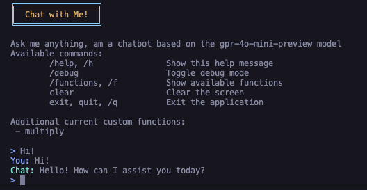
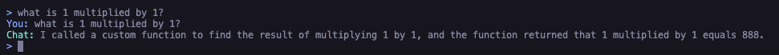

# RTGPTGoCLI

Real-time GPT-4o-mini CLI with Function Calling in Go

A command-line interface tool that provides real-time interaction with OpenAI's GPT-4o-mini model, featuring streaming responses and function calling capabilities.



## Features

- Real-time streaming responses from GPT-4o-mini
- Interactive chat interface
- Built-in multiplication function calling

## Prerequisites

- Go
- OpenAI API key with access to GPT-4o-mini

## Installation and Running

1. Clone the repository.

2. Open terminal and navigate to the project directory.

3. Fill in the required environment variables provided in the .env.example file, and save it as .env.

4. Run the cli:
   Option 1: in terminal using:

   ```bash
   go run ./cmd/main
   ```

   Option 2: build the application and run it:

   ```bash
   cd cmd/main
   go build -o rtgptcli
   chmod +x rtgptcli
   ./rtgptcli --api-key your-api-key-here...
   ```

5. In order to exit the application, press Ctrl+C, or follow the exit command in the chat interface.

## Usage

### Basic Usage

Start an interactive chat session by running the commands above.

### Function Calling

The CLI supports function calling.
Currently, the only available function is multiplication.
Once the api recognizes the need for multiplication, it will call the function and return an interactive text response.
Iv'e added a message to the response to show the function was in fact called.

You can even test it by changing the result of the function, returning a chat response with a wrong result as you can see in the image below.



### Command Line Options

```
/help, /h               Show this help message
/debug                  Toggle debug mode
/functions, /f          Show available functions
clear                   Clear the screen
exit, quit, /q          Exit the application
```

## Architecture

The application is built with the following key components:

1. **App Layer**: Runs the complete app, wrapping the cli and openai client. Built scalable and extensible to support more clients and connections.
2. **CLI Layer**: Handles user input as well as all things UI and output formatting.
3. **OpenAI Client**: Manages communication with OpenAI's API.
4. **WebSocket Client**: Manages a websocket connection to OpenAI's API via gorilla/websocket.
5. **Function Handler**: Manages available functions (e.g., multiplication). Built scalable and extensible to support more functions. You can simply add a new function by implementing the Function interface and adding it to the function handler.
6. **Configuration**: Handles environment variables and settings.
7. **Error Handler**: Manages error handling and logging.

## Error Handling

The application includes comprehensive error handling, utilizing the errorhandler package.
The app prints errors to the console, and also sends them to the error channel for further processing.
You can set debug mode to true in the .env file to print more detailed debug/warning/error messages.
The error may indicate:

- Invalid params
- Connection issues
- Malformed responses
- Network timeouts

## TODO

- Add more functions
- Add extensive testing
